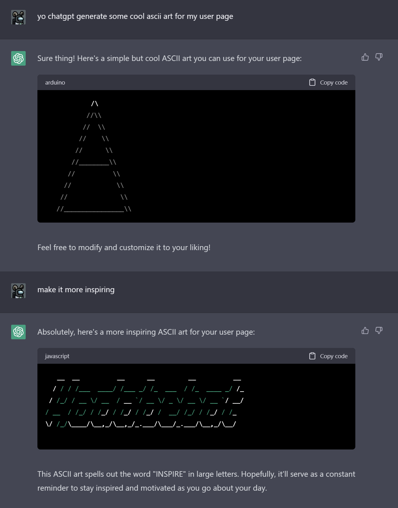

# Marcelo Shen <!-- omit from toc -->

## Table of Contents 
- [Table of Contents](#table-of-contents)
- [Picture](#picture)
- [Who am I](#who-am-i)
- [Who am I as a programmer](#who-am-i-as-a-programmer)
- [Never gonna give you up](#never-gonna-give-you-up)
- [Readme?](#readme)
- [Jokes?](#jokes)
- [Hobbies?](#hobbies)
- [Two Truths One Lie?](#two-truths-one-lie)
- [I used chatgpt for this section of page:](#i-used-chatgpt-for-this-section-of-page)
- [Jump around?](#jump-around)
- [Back to the top.](#back-to-the-top)

## Picture

> ^ hey that's ***[me](https://github.com/dowhep)***

## Who am I
I am a second-year computer engineering major at UCSD. 

## Who am I as a programmer
I like trying new stuff and learning new framework/structures/problem solving techiques.

## Never gonna give you u[p](https://www.youtube.com/watch?v=dQw4w9WgXcQ)
Never gonna let you down

## Readme?
[Read](README.md)[m](#never-gonna-give-you-up)[e.](README.md)

## Jokes?
[Jokes.](https://www.youtube.com/watch?v=dQw4w9WgXcQ)
- Jokes aside,
- Here is another authentic joke:
  - A programmer went a butcher shop to get `1kg` of meat.
  - However, the programmer return the second day and asked:
    - "Why is my meat `24g` short?"

## Hobbies?
[Hobbies.](https://www.youtube.com/watch?v=dQw4w9WgXcQ)
1. Watching Youtube
2. Vibing to M[u](#readme)sic
3. $Math$
4. *Chess*
5. Rickrolling readers who read this page.

## Two Truths One Lie?
- [ ] I learned how to paraglide!
- [ ] I make music for fun!
- [x] I am lying right now!

 Wait hold up...\

## I used chatgpt for this section of page:

## Jump around?
Click the hidden letter from this sentence to en[j](#hobbies)oy some section jumps.

## [Back to the top.](#table-of-contents)
